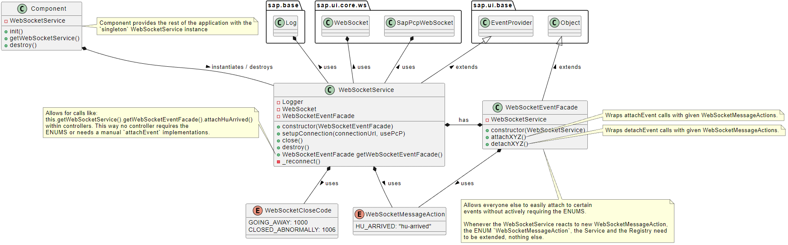

# UI5 with simple WebSocket Implementation

I recently worked a bit with WebSockets and had the fun to also use [APC/AMC](https://help.sap.com/docs/SAP_NETWEAVER_750/05d041d3df1a4595a3c45f57c15e2325/18ef61f6415743658407d4d17f06e950.html?version=7.5.9&locale=en-US) in addition to that.

In my specific use-case we have some sort of pseudo-login which is reponsible for establishing a WebSocket connection. But also close a connection
whenever the user performs a "logout"/leaves. I know logouts are tricky and I don't even want to go too deep into that. The "logout" I'm speaking
about here is a simple backwards navigation.

Of course one has to consider:

- ICF Path for logoff
- F5/Tab Refresh
- Closing the Browser
- Closing the Tab
- etc.

Most of these scenarios, especially with Internet Explorer, are just a dead end, nothing you can do without actively listening to the wildest things and doing it dirty/hacky. *If you have some Best Practices though, go ahead and shoot me a message, I'm happy & eager to learn*. If you're lucky enough to use the [Beacon API](https://developer.mozilla.org/en-US/docs/Web/API/Beacon_API) go ahead!

So what did I do? I created a "WebSocketService" that does exactly what I need it to do. Not as flexible, resiliant and overall good designed as I'd like it to be but well, there are deadlines to be kept. The Service I'm using in this repository is a bit different as it uses some sort of "EventFacade", or "Registry" if you will(?), to hide some of the `attachEvent` logic behind an object and not enormously bloat up the WebSocketService itself too much.

Overall It was my first time not directly going for the [EventBus](https://ui5.sap.com/sdk/#/api/sap.ui.core.EventBus) so I was excited to learn new things and try out extending the [EventProvider](https://ui5.sap.com/sdk/#/api/sap.ui.base.EventProvider). This gives us the opportunity to work less "global" and have a better overview of whats happening, i.e. publishing/firing events, compared to using a general/generic global Eventing Tunnel but in this case only one specific object instance which is used instead. So ... in theory better maintainability, right?

The way I'm using it though, I'm not so sure if that is still the case or if that even makes sense but when I first came up with this, I was quite happy. I'll admit that much. I'm generally usually unhappy with what I do even if it does what it needs to. I just think I'm quite horrible in building/designing these things. Honestly speaking I'd probably rethink the entire thing about 300 more times, if I had the time. Then again, there is only so much "Web Developer" inside of me, and no one I can really ping-pong off for ideas so I'll leave it as is for now.

## Design/Idea Overview

I'm horrible with UML, so don't judge me. 😅 Some of the classes mentioned here aren't "real" compositions as they're not directly passed in through the constructor, but you get the gist.



The above Image describes a way of breaking up
the dependencies between the WebSocketService
and which Events other can listen to (attach/detach).

This is done by introducing a new Object, some sort
of "registry" or "facade" where every possible event
which could be fired according to an Actions-ENUM
will be wrapped to expose a more "user-friendly"-API.
Instead of retrieving the WebSocketService Instance and
manually attaching events (+ using the ENUM) like so:

```js
const myWsService = this.getWebSocketService();
myWsService.attachEvent(ENUM.action, this.myHandlerFunction);
myWsService.detachEvent(ENUM.action, this.myHandlerFunction);
```

you could do it like this:

```js
const myFacade = this.getWebSocketService().getWebSocketEventFacade();
myFacade.attachMyActionEvent(this.myHandlerFunction)
myFacade.detachMyActionEvent(this.myHandlerFunction)
```

Although in this example it is not done for everything. There are a few events which haven't had the honor to be taken into the ENUM. Namely all the events that do not map to a particular action the frontend necessarily *wants* to listen to. The ENUM is just used as some sort of contract, some sort of consistency to match with whatever comes from the Backend. Therefore some of the rather technical or fallback events like `close`, `open`, `message` are not considered here.

That is not a problem though, as these can just be taken into account within the "EventFacade".

## F.A.Q

> Why is the connection setup not happening in the constructor?

In my use-case I wanted to have the WebSocketService somewhat global but not as generic as the EventBus. That is why the Service Instance lives at component level and is implicitly handled as Singleton. Implicitly because the instance itself has bit state-management itself but doesn't really prevent instantiation on a technical level. It is instantiated and destroyed on component level and handed down into the rest of the application via a BaseController.

I'd definitely think more about this in the future. In our case we didn't need multiple connections to different URLs. The actual URL for the connection was only available at a certain point in time (after the pseudo-login).

Maybe a technical Singleton-Instance which gets created on component level, has a setter for the URL or something like that would be good. It's a bit tricky though as we require this "critical" information whenever we create the actual WebSocket instances internally, which would not be the same point in time our constructor gets called for creating a new instance of the Service. Another way would be to throw this "Service" away completely and directly use the UI5 standard services within one of the controllers but then again I think I would need to make use of the EventBus or similar.

> Is the "Facade" necessary?

Not at all. Any Controller/Object can just take the "WebSocketService"-Instance and call `attachEventXYZ` or `detachEventXYZ` on it.

> Are you using valid JSDoc

I'm really trying. Still not that familar with how to properly use it in custom projects, other than basic JS types or defining custom Types ([@typedef](https://jsdoc.app/tags-typedef.html)) per file
and including them everywhere (can't be the rigth/best approach, right?).

## NodeJS WebSocket Server for Testing

Simple NodeJS WebSocket Package [ws](https://github.com/websockets/ws)

## Credits

This project has been generated with 💙 and [easy-ui5](https://github.com/SAP).

I'm standing on the shoulders of giants. Thanks.

- [Gregor Wolf](https://github.com/gregorwolf) PCP: https://blogs.sap.com/2015/09/07/abap-push-channel-messaging-channel-and-sapui5-demo-application/
- [Holger Schäfer](https://mobile.twitter.com/hschaefer123): https://btp.udina.de/development/websocket.html#sapui5
- PCP Protocl Spec: https://blogs.sap.com/2015/07/27/specification-of-the-push-channel-protocol-pcp/
- Cool WebSocket Extension (Chrome): https://chrome.google.com/webstore/detail/websocket-test-client/fgponpodhbmadfljofbimhhlengambbn?hl=en
